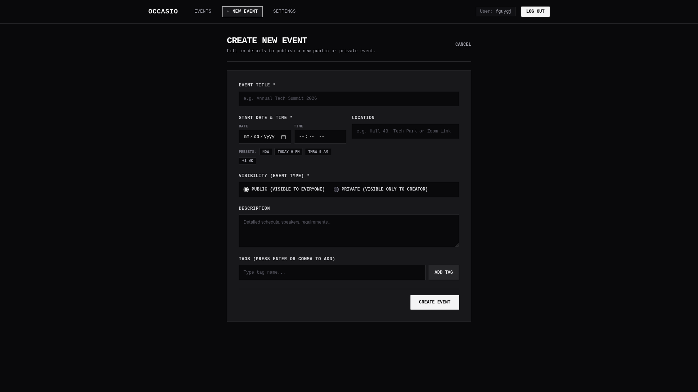
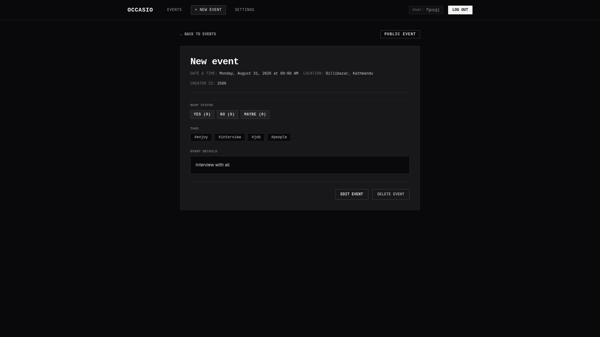

# Occasio

A full-stack event planning platform built with Node.js, Express, TypeScript, Knex.js, MySQL, React, and Tailwind CSS.

---

## Screenshots

Placeholders for application UI screenshots (save captured images into `docs/screenshots/`):

  
*Events List Page — Displaying event grid, search/tag filter bar, and RSVP status badges.*

  
*Create Event Form — Interface for creating new public or private events with tag selection.*

  
*Event Detail Page — Detailed event information, creator actions, tag badges, and interactive RSVP controls.*

---

## Engineering Decisions

### 1. Express + Knex.js + MySQL (No ORMs)

- **Design Choice & Assessment Constraint**: The backend uses Knex.js query builder directly over MySQL without ORMs (such as Prisma, TypeORM, or Sequelize).
- **Rationale & Trade-offs**: While ORMs provide high-level abstractions, a query builder grants full visibility and control over generated SQL queries, indexing, joins, and execution plans. This avoids the query bloat, opaque hydration overhead, and schema drift common with heavy ORMs, while maintaining strong type safety with TypeScript.

### 2. Strict Layered Architecture (`routes -> controller -> service -> repository`)

- **Routes (`*.routes.ts`)**: Defines HTTP endpoints, applies validation middleware (`validate(schema)`), authentication middleware (`authenticate` or `optionalAuth`), and embeds Swagger OpenAPI annotations.
- **Controller (`*.controller.ts`)**: Handles HTTP transport concerns, extracts typed request parameters/body, delegates to domain services, and structures responses using the standardized envelope via `sendResponse`.
- **Service (`*.service.ts`)**: Encapsulates core business logic, domain rules, and authorization/ownership validation (e.g., verifying that only an event's creator can update or delete it).
- **Repository (`*.repository.ts`)**: The **only** layer that interfaces directly with Knex and executes database queries. Confining database operations to repositories keeps data access completely isolated and mockable for testing.

### 3. JWT Authentication with Rotating Refresh Tokens

- **Short-Lived Access Tokens**: Issued with a 15-minute expiry and sent in JSON response bodies for Bearer authorization. This bounds exposure time in the event of client-side token interception.
- **Long-Lived Refresh Tokens**: Issued with a 7-day expiry and stored in an `httpOnly`, `SameSite=Strict`, `Secure` (in production) cookie, completely inaccessible to browser JavaScript to guard against XSS extraction.
- **Token Hashing & Rotation**: Refresh tokens are stored in the database only as SHA-256 hashes. Upon every refresh request, the existing refresh token is immediately revoked (invalidated) and replaced with a newly issued token pair (rotation), preventing replay attacks and detectably invalidating compromised token chains.

### 4. Centralized Config, Constants & Validation

- **Typed Environment Variables**: Loaded and validated via Zod in `src/config/env.ts` at startup to ensure fail-fast initialization if required variables are missing or malformed.
- **Central Constants**: All HTTP status codes (`httpStatus`), domain error codes (`errorCodes`), and messages (`errorMessages`) are organized in `src/constants/`, eliminating magic numbers and ad-hoc strings across the codebase.
- **Zod Request Validation**: Every route validates incoming payload structures before reaching controllers via `validate()` middleware.

### 5. Standardized Response Envelopes

Every API endpoint adheres to uniform JSON response envelopes:

- **Success Responses**:

  ```json
  {
    "success": true,
    "data": { ... },
    "meta": { "page": 1, "limit": 10, "total": 100 }
  }
  ```

  *(The `meta` object is optional and omitted when pagination/filtering metadata is not present).*

- **Error Responses**:

  ```json
  {
    "error": {
      "code": "ERROR_CODE",
      "message": "Human-readable error description",
      "details": [
        { "field": "fieldName", "message": "Field error description" }
      ]
    }
  }
  ```

  *(The `details` property is optional and specifically populated on validation failures (`400 Bad Request`) to provide field-level error messages; it is omitted on other error responses).*

### 6. Interactive OpenAPI / Swagger Documentation

- Every route is documented with `@swagger` JSDoc annotations referencing shared schemas (`ErrorResponse`, `BearerAuth`).
- Interactive Swagger UI documentation is automatically generated and served at `/api-docs`.

### 7. Dual-Tier Rate Limiting

- **Strict Auth Limiter**: Applied to sensitive authentication endpoints (`/auth/login`, `/auth/signup`, `/auth/refresh`) to prevent brute-force attacks.
- **General API Limiter**: Applied globally to protect API endpoints against DDoS and excessive traffic abuse.
- **Standard Envelope on 429**: Custom rate limit handlers format `429 Too Many Requests` responses using the standard JSON error envelope (`RATE_LIMIT_EXCEEDED`).

### 8. Tags & Many-to-Many Architecture

- **Normalized Storage**: Dedicated `tags` table and `event_tags` junction table with foreign key constraints and cascade deletions.
- **Case-Insensitive Deduplication**: Tag names (e.g. `Tech`, `tech`, `TECH`) are automatically normalized and deduplicated upon creation.
- **"Any Tag Matches" Filter**: Filtering events by tag on `GET /events?tags=...` uses disjunctive (OR) semantics — an event matching at least one requested tag is included in the result set.

### 9. RSVP State & Ownership Model

- **Unique Constraint**: Database constraint `(user_id, event_id)` enforces exactly one RSVP record per user per event.
- **Upsert-in-Place**: Status transitions (`GOING`, `MAYBE`, `NOT_GOING`) utilize `ON DUPLICATE KEY UPDATE` to eliminate duplicate rows while keeping state updates atomic.
- **Visibility-Gated**: RSVP endpoints verify event visibility first. Attempting to RSVP to a private event that the requesting user cannot access returns `404 Not Found` (`EVENT_NOT_FOUND`).

### 10. Two-Tier Testing Strategy

- **Unit Tests** (`npm run test:unit --workspace=backend`): Fast, isolated test suite using Vitest with mocked repository layers. Validates business logic, authorization rules, and edge cases in milliseconds without database setup.
- **Integration Tests** (`npm run test:integration --workspace=backend`): Full HTTP flow tests using Supertest against a live MySQL test database. Verifies actual Knex SQL queries, schema constraints, middleware execution, and token rotation.
- **Why Both?**: Unit tests deliver instant feedback during active development, while integration tests guarantee end-to-end system correctness across the HTTP transport and database layer.

### 11. Request & Error Logging

- **HTTP Access Logs**: Structured request logging via `morgan` middleware formatting status codes, response times, and HTTP verbs.
- **Tiered Error Logging**: Client-side operational errors (4xx validation or auth errors) generate concise warning log entries, while full stack traces are logged exclusively for unexpected 5xx server errors to keep production logs clean and actionable.

### 12. Frontend Component Architecture & Monochrome UI Design

- **Feature-Based Modular Structure**: Code organized by domain feature inside `frontend/src/features/*` (`auth`, `events`) alongside reusable routing, state hooks, and API clients.
- **Accessible UI Primitives (shadcn/ui & Base UI)**: Styled components (`frontend/src/components/ui/`) built on Base UI primitives and styled via Tailwind CSS.
- **State Management**: TanStack Query (`react-query`) handles server state caching, background refetching, and optimistic updates for RSVPs, paired with Zustand for global auth session state.
- **Strict Monochrome Design**: Built with Tailwind CSS adhering to a high-contrast monochrome aesthetic (black, white, zinc/neutral scale).

---

## Setup Instructions

Follow these steps for setting up and running the project locally (tested on Windows PowerShell, macOS, and Linux):

### 1. Configure Environment Variables

Copy the example environment configuration to create `.env` files for both backend and frontend:

```bash
# Backend Environment
cp .env.example .env

# Frontend Environment
cp frontend/.env.example frontend/.env
```

Ensure database credentials, server port, and JWT secrets in `.env` match your local environment.

### 2. Start MySQL Database

Launch the MySQL container in the background using Docker Compose:

```bash
docker compose up -d
```

### 3. Install Dependencies

Install all workspace dependencies from the root directory:

```bash
npm install
```

### 4. Run Database Migrations

Execute Knex migrations to create database tables (`users`, `refresh_tokens`, `events`, `tags`, `event_tags`, `event_rsvps`):

```bash
npm run db:migrate --workspace=backend
```

### 5. Start Backend & Frontend Dev Servers

Both backend and frontend servers must be running simultaneously for the application to work properly:

#### Terminal 1 — Backend API Server (Port 4000)
```bash
npm run dev --workspace=backend
```

#### Terminal 2 — Frontend Dev Server (Port 5173)
```bash
npm run dev --workspace=frontend
```

### 6. Verify Application & API Documentation

Open your browser and navigate to:

- **Frontend Application**: [http://localhost:5173](http://localhost:5173)
- **Backend API & Swagger Docs**: [http://localhost:4000/api-docs](http://localhost:4000/api-docs)

### 7. Run Test Suite

Execute the integration and unit test suites across all modules:

```bash
# Run all workspace tests
npm test

# Run backend unit tests only
npm run test:unit --workspace=backend

# Run backend integration tests only
npm run test:integration --workspace=backend
```

---

## Assumptions

- **Private Event Visibility**: Events with `event_type = 'private'` are strictly visible only to their creator. When queried by unauthenticated visitors or other users, private events are excluded from `GET /events` listings, and direct lookups via `GET /events/:id` return `404 Not Found` (`EVENT_NOT_FOUND`) rather than `403 Forbidden`. This avoids confirming or leaking the existence of private events to unauthorized parties.
- **Tag Filtering Semantics**: Tag filtering on `GET /events` uses "any tag matches" semantics — an event matching at least one requested tag is included, not requiring all requested tags to match.
- **RSVP Visibility Constraints**: Users can only submit RSVPs for public events or private events they own. RSVP requests for non-existent or inaccessible private events return `404 Not Found`.
